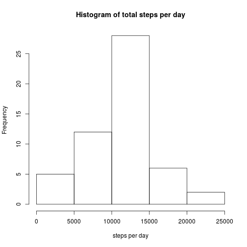
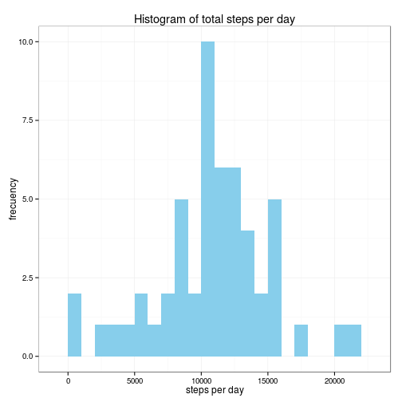
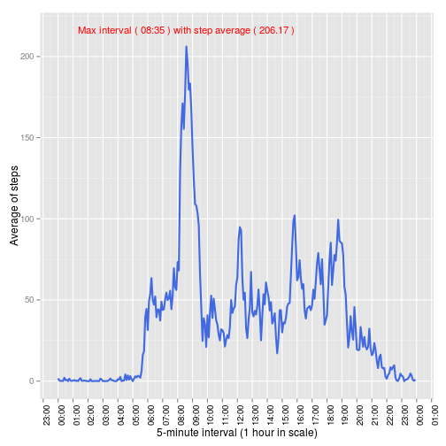
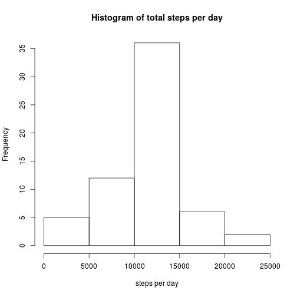
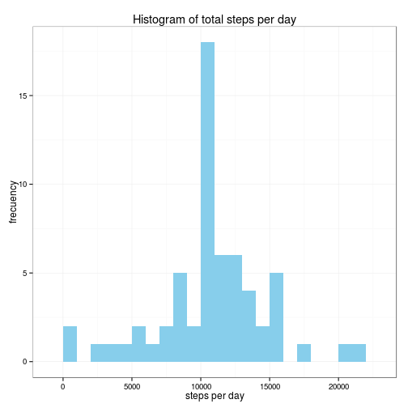
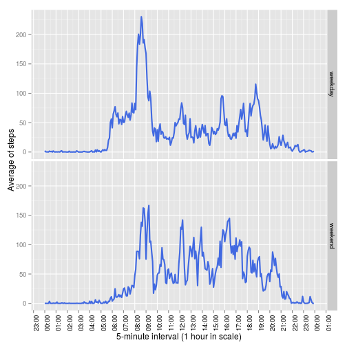

## Loading and preprocessing the data

General code to prepare the R environment  


```r
library(plyr)
library(ggplot2)
library(scales)
```

Useful code chunk in case that someone prefers to download the .Rmd and reproduce 
it without cloning the repository  
  

```r
##  function setup.filedata() 
##      Parameter:
##          URL to download
##
##      Functionality:
##          1. Decode the url and get the file to download
##          2. Download the file to /tmp folder in case that data file or zip 
##              file don't be found
##          3. Extract the data file, if the zip file was necessarily downloaded
##
setup.filedata <- function(url) {
    list <- strsplit( URLdecode(url), "/" )[[1]]
    zipfile <- list[ length(list) ]
    filename <- sub(".zip$", ".csv", zipfile)
    
    if ( file.exists( filename ) ) invisible(return())
    
    if (! file.exists( zipfile )) {
        tempfile <- paste0("/tmp/", zipfile)   # tempfile( tmpdir = "/tmp" )
        
        if (! file.exists( tempfile )) {
            print(url)
            download.file( url, tempfile )
            zipfile <- tempfile
        }
    }
    unzip( zipfile )
}

setup.filedata("https://d396qusza40orc.cloudfront.net/repdata%2Fdata%2Factivity.zip")
```

### 1. Load the data


```r
data <- read.csv("activity.csv", stringsAsFactor = FALSE)
```

### 2. Transform the data

Convert to proper classes, date as Date and interval as Factor.


```r
data <- mutate(data, 
               date = as.Date(date, format = "%Y-%m-%d"),
               interval = as.integer(interval))
```

Get a first glance.


```r
head(data)
```

```
##   steps       date interval
## 1    NA 2012-10-01        0
## 2    NA 2012-10-01        5
## 3    NA 2012-10-01       10
## 4    NA 2012-10-01       15
## 5    NA 2012-10-01       20
## 6    NA 2012-10-01       25
```

```r
str(data)
```

```
## 'data.frame':	17568 obs. of  3 variables:
##  $ steps   : int  NA NA NA NA NA NA NA NA NA NA ...
##  $ date    : Date, format: "2012-10-01" "2012-10-01" ...
##  $ interval: int  0 5 10 15 20 25 30 35 40 45 ...
```

## What is mean total number of steps taken per day?

### 1. Calculate the total number of steps taken per day (ignoring the missing values)


```r
stepsPerDay <- aggregate(steps ~ date, data, sum)
```

### 2 Make a histogram of the total number of steps taken each day


```r
stepsPerDay.baseHistogram <- function(df){
    hist(df$steps, xlab = "steps per day", main = "Histogram of total steps per day")    
}

stepsPerDay.baseHistogram(stepsPerDay)
```

 

NOTE: FOR THE GRADING PURPOSE ONLY. In order to make the grading work easier, and as there is no information about any clue of the scale or plotting system to use, I'm posting the same thing with ggplot2 system in order that you could compare with yours.


```r
stepsPerDay.ggplotHistogram <- function(df){
    ggplot(df, aes(x = steps)) +
        geom_histogram(fill = "skyblue", binwidth = 1000) + 
        labs(x = "steps per day", y = "frecuency", title = "Histogram of total steps per day") +
        theme_bw()
}

stepsPerDay.ggplotHistogram(stepsPerDay)
```

 

### 3 Calculate and report the mean and median of the total number of steps taken per day


```r
mean <- mean(stepsPerDay$steps)
median <- median(stepsPerDay$steps)
```

The mean is 1.0766189 &times; 10<sup>4</sup> and median is 1.0765 &times; 10<sup>4</sup>

## What is the average daily activity pattern?

Compute the average of steps for each 5-minute interval.


```r
intervalsMean <- aggregate(data$steps, by = list(data$interval), mean, na.rm = TRUE)
names(intervalsMean) <- c("interval", "stepsMean")
intervalsMean$interval <- as.POSIXct(strptime(sprintf("%04d", intervalsMean$interval), format="%H%M"))
```

Calculate which 5-minute interval, on average across all the days in the dataset, contains the maximum number of steps


```r
max <- intervalsMean[which.max(intervalsMean$stepsMean), ]
```

Show the time series plot with the maximun labeled.


```r
ggplot( intervalsMean, aes(x = interval, y = stepsMean) ) + 
        geom_line(color = "royalblue", size = 1) +  
        annotate( "text", 
                  label = paste("Max interval (", format(max$interval, "%H:%M"),
                                ") with step average (", round(max$stepsMean, digits = 2), ")"), 
                  x = max$interval,
                  y = max$stepsMean + 10,
                  size = 4, 
                  colour = "red") +
        scale_x_datetime(breaks = date_breaks("1 hour"), 
                         labels = date_format("%H:%M") ) + 
        theme(axis.text.x  = element_text(angle = 90, colour = "black", vjust = 1)) + 
        labs( x = "5-minute interval (1 hour in scale)", y = "Average of steps" )
```

 

## Imputing missing values

### 1. Calculate and report the total number of missing values in the dataset (i.e. the total number of rows with NAs)

Missing values can be calculated by many ways (The source code of this .Rmd is a living example). 
Summary() function shows in the last row 2304 NAs.


```r
summary(data)
```

```
##      steps             date               interval     
##  Min.   :  0.00   Min.   :2012-10-01   Min.   :   0.0  
##  1st Qu.:  0.00   1st Qu.:2012-10-16   1st Qu.: 588.8  
##  Median :  0.00   Median :2012-10-31   Median :1177.5  
##  Mean   : 37.38   Mean   :2012-10-31   Mean   :1177.5  
##  3rd Qu.: 12.00   3rd Qu.:2012-11-15   3rd Qu.:1766.2  
##  Max.   :806.00   Max.   :2012-11-30   Max.   :2355.0  
##  NA's   :2304
```

### 2. Devise a strategy for filling in all of the missing values in the dataset. The strategy does not need to be sophisticated. For example, you could use the mean/median for that day, or the mean for that 5-minute interval, etc.

Trying to select one of those 2 simple strategies to fill the missing values, we could do some "simple" analyses too.
Check how NAs affects the measured days.


```r
na.values <- data[ !complete.cases(data), ]
table(na.values$date)
```

```
## 
## 2012-10-01 2012-10-08 2012-11-01 2012-11-04 2012-11-09 2012-11-10 
##        288        288        288        288        288        288 
## 2012-11-14 2012-11-30 
##        288        288
```

```r
### interesting issue
length(unique(data$interval))
```

```
## [1] 288
```

As it can be seen, the amount of missing values in all of those days are the same to the amount of intervals. That means that the whole days are missing, so, it has no sense to select the mean/median for each days.


```r
table( weekdays( unique( na.values$date ) ) )
```

```
## 
##    Friday    Monday  Saturday    Sunday  Thursday Wednesday 
##         2         2         1         1         1         1
```

Besides, anybody could think before hand that those strategies aren't useful enough, because we would be mixing measures completely unrelated (e.g: interval 6:00-6:05 AM with 3:00-3:05 PM). Therefore, the most appropiate approach is the mean for that 5-minute interval, but it seems even more "logically" accurate the mean of the intervals on the same day of the week, that will be analized later.


```r
# Create a temporal data.frame with the day of the week included
dateTime <- as.POSIXct(strptime(sprintf("%s %04d", data$date, data$interval), format="%Y-%m-%d %H%M"))
temp <- mutate(data, wday = weekdays(dateTime))

# Compute the means for each interval
means <- with(temp, aggregate(steps, by = list(interval), mean, na.rm = TRUE))
names(means) <- c("interval", "mean")
means$mean <- round(means$mean, digits = 2)
```

### 3. Create a new dataset that is equal to the original dataset but with the missing data filled in.

Copy the data.frame used before where it was inserted the correct datetime as a column, and substitute the missing values in 'steps' with the corresponding pre-computed mean.


```r
imputedData <- temp
NAindex <- which( is.na(imputedData$steps) )
new.steps <- unlist( lapply( NAindex,
        function(idx){
            int <- imputedData$interval[idx]
            means[ means$interval == int , ]$mean
        }
    )
)
imputedData$steps[NAindex] <- new.steps
```

### 4.1 Make a histogram of the total number of steps taken each day and Calculate and report the mean and median total number of steps taken per day. 


```r
stepsPerDay.imputed <- aggregate(steps ~ date, imputedData, sum)

stepsPerDay.baseHistogram(stepsPerDay.imputed)
```

 

```r
stepsPerDay.ggplotHistogram(stepsPerDay.imputed)
```

 

```r
mean.imputed <- mean(stepsPerDay.imputed$steps, na.rm = TRUE)
median.imputed <- median(stepsPerDay.imputed$steps, na.rm = TRUE)
```

The mean and median with NAs subtituted are 1.0766181 &times; 10<sup>4</sup> and 1.076613 &times; 10<sup>4</sup>.  

### 4.2 Do these values differ from the estimates from the first part of the assignment? 


```r
cmean <- c(mean, mean.imputed)
cmedian <- c(median, median.imputed)
df <- data.frame(cbind(cmean, cmedian), row.names = c("before", "after"))
names(df) <- c("mean", "median")
df           
```

```
##            mean   median
## before 10766.19 10765.00
## after  10766.18 10766.13
```

These new values are slightly different than the previous.

### 4.3 What is the impact of imputing missing data on the estimates of the total daily number of steps?

The mean keeps almost the same value (as it should be due to the strategy selected), and the median get closer to the mean but don't suppose any dramatical change to infer with the new data.

## Are there differences in activity patterns between weekdays and weekends?

### 1. Create a new factor variable in the dataset with two levels – “weekday” and “weekend” indicating whether a given date is a weekday or weekend day.


```r
weekend <- c("Sunday", "Saturday")
imputedData$weekdayType <- as.factor(ifelse(imputedData$wday %in% weekend, "weekend", "weekday"))
```

### 2. Make a panel plot containing a time series plot (i.e. type = "l") of the 5-minute interval (x-axis) and the average number of steps taken, averaged across all weekday days or weekend days (y-axis). See the README file in the GitHub repository to see an example of what this plot should look like using simulated data.


```r
weekdayIntervalMean <- aggregate( imputedData$steps, 
                                  by = list(imputedData$interval, imputedData$weekdayType), 
                                  mean, na.rm = TRUE)
names(weekdayIntervalMean) <- c("interval", "weekdayType", "mean")
weekdayIntervalMean$interval <- as.POSIXct(strptime(sprintf("%04d", weekdayIntervalMean$interval), format="%H%M"))

ggplot( weekdayIntervalMean, aes(x = interval, y = mean) ) + 
        geom_line(color = "royalblue", size = 1) +  
        facet_grid(weekdayType ~ .) + 
        scale_x_datetime(breaks = date_breaks("1 hour"), 
                         labels = date_format("%H:%M") ) + 
        theme(axis.text.x  = element_text(angle = 90, colour = "black", vjust = 1)) + 
        labs( x = "5-minute interval (1 hour in scale)", y = "Average of steps" )
```

 

From the plots, one can see that this person starts moving actively around 5:30AM on weekdays, possibly to prepare for work. There is a peak from 8:00 to 9:00AM that can be assumed that is when he/she walks to work.  
While on weekends, starts around 6 am and the activities have higher peaks regularly along the day, possibly due to sports or walking away on his/her free time. 

At Night, the activity drop from 8 pm with some movements perhaps inside his/her house.

